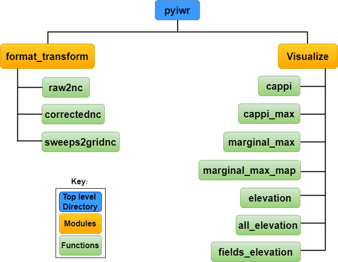

# pyiwr Package Documentation


Welcome to the documentation for pyiwr (Python Indian Weather Radar Toolkit)!!

## Developers
1. Nitig Singh, MS Research, SIGMA Research Lab, IIT Indore
2. Vaibhav Tyagi, Ph.D. Research Scholare, SIGMA Research Lab, IIT Indore

## Table of Contents
- [Home](index.md)
- [Installation](installation.md)
- [Implementation](usage.md)
- [Example Usage](example.md)
- [Reference](Reference.md)
- [Contribution Guidelines](contribution.md)
- [Citation](Citation.md)

  # Implementation

  The pyiwr architecture is designed as an user-friendly toolkit, specifically tailored to address the distinctive requirements of dual-pol DWR data analysis. The architecture of the two primary modules format\_transform and visualize serves a vital role in streamlining the radar data processing workflow as shown in figure below.




## A. Format transform and reading data as radar object/xarray grid
```python
# For dwr raw files
radar = pyiwr.format_transform.raw2nc(filename, save_file=True)

# For mosdac nc files
radar = pyiwr.format_transform.correctednc(filename, save_file=True)

# For xarray grids for mosdac nc files
xarray_grids = pyiwr.format_transform.sweeps2gridnc(filename, grid_shape=(81, 501, 501), height=20, length=250, save_file=True)
```
## B. Visualization CAPPI
```python
# For CAPPI in cartesian plane
pyiwr.visualize.cappi(xarray_grids, altitude_level=3, field_name='DBZ', radar_location='CHERRAPUNJI',
                        grid=False, rings=False, ticks_in_km=True, save_image=True, img_name='img.png')

# For MAX CAPPI in cartesian plane
pyiwr.visualize.cappi_max(xarray_grids, field_name='DBZ', radar_location='CHERRAPUNJI',
                        grid=False, rings=False, ticks_in_km=True, save_image=True, img_name='img.png')

# For MAX CAPPI (with marginal cross-sections) in cartesian plane
pyiwr.visualize.marginal_max(xarray_grids, radar_location='SHAR', field_name='DBZ', show_rings=True,
                        show_grid=True, show_cross_sections=True, save_image=True, img_name='img.png')

# For MAX CAPPI (with marginal cross-sections) with map
pyiwr.visualize.marginal_max_map(xarray_grids, radar_location='TERLS', field_name='DBZ',
                       background='terrain-background', cross_sections=True, save_image=True, img_name='img.png')
```
## C. Visualization PPI
```python
#For PPI at specefic elevation
pyiwr.visualize.elevation(radar, field_name='DBZ', elevation_index=0, rings=True, grid=True, range_in_km=True, save_image=True,
                          img_name='img.png')
#For PPI of any field at all elevation
pyiwr.visualize.all_elevation(radar, field_name='DBZ', rings=True, grid=True, range_in_km=True, save_image=True,
                          img_name='img.png')
#For PPI of all fields
pyiwr.visualize.fields_elevation(radar, elevation_index=0, range_in_km=True, rings=True, grid=True, save_image=True,
                          img_name='img.png')
```
